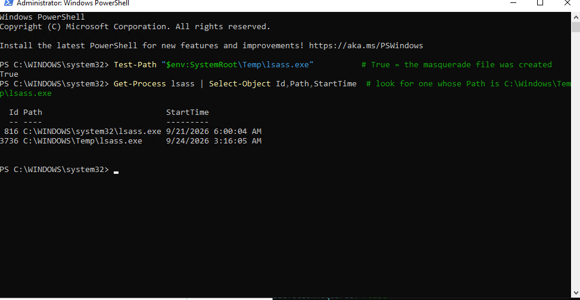
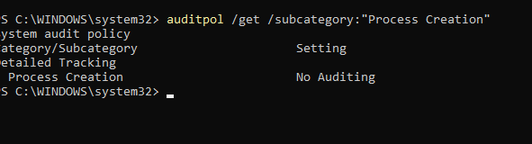
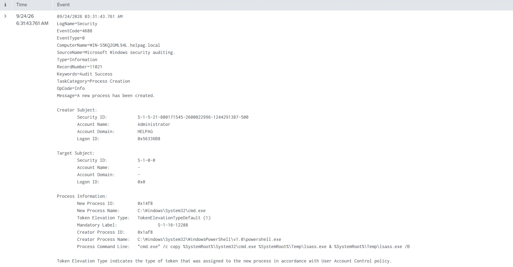
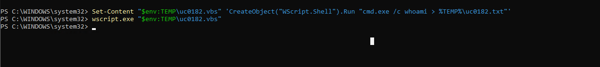
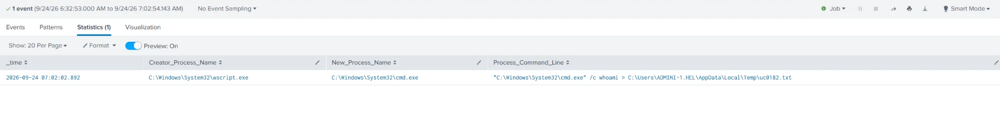

# TDA Detection Validation — Tested Procedures (Lab-Proven)

Reusable, step-by-step procedures for triggering and validating two TDA use
cases. **Validated in the lab** on host `WIN-S5KQ2GML94L` — ready to reuse on a
customer TDA engagement. All tests use safe, standard tooling (Atomic Red Team,
Windows Script Host). Nothing here is real malware.

> Before running on customer infra: confirm written authorization, a test
> window with the SOC, and whether you're allowed to change host config
> (some steps below enable audit logging).

**Legend:** 🟢 attack executed · 🟢 telemetry in SIEM · ⬜ alert/correlation to confirm

---

## UC0036 — APT Group Process Creation

**Technique:** MITRE **T1036.003** – Masquerading: Rename System Utilities
(Atomic Red Team test #1, "Masquerading as Windows LSASS process").
A malicious process is renamed to look like a trusted system process
(`lsass.exe`) and run from the wrong location. Used by many APT groups.

### Prerequisites
- Windows endpoint with the EDR agent + Splunk forwarder.
- Atomic Red Team installed (see Appendix).

### Steps (run on the endpoint, PowerShell as Administrator)

```powershell
# 1. Load Atomic module (if a fresh window)
Import-Module "C:\AtomicRedTeam\invoke-atomicredteam\Invoke-AtomicRedTeam.psd1" -Force

# 2. Preview what the test does
Invoke-AtomicTest T1036.003 -TestNumbers 1 -ShowDetails

# 3. Record marker (for finding the event later)
Get-Date -Format "yyyy-MM-dd HH:mm:ss" ; hostname

# 4. Fire the test  (NOTE: it "hangs" ~120s by design, then times out — normal)
Invoke-AtomicTest T1036.003 -TestNumbers 1

# 5. Clean up
Invoke-AtomicTest T1036.003 -TestNumbers 1 -Cleanup
```

The test copies `cmd.exe` → `C:\Windows\Temp\lsass.exe` and runs it, so a process
named `lsass.exe` executes from `Temp` (the real one only runs from `System32`).

### Endpoint proof
```powershell
Get-Process lsass | Select-Object Id,Path,StartTime
```
Two `lsass.exe` show up — the real one from `System32`, and the fake one from
`C:\Windows\Temp` started at test time:



### ⚠️ Common gap found in lab: process creation not logged
First run produced **0 events** in Splunk. Root cause — process-creation
auditing was **disabled** on the host:
```powershell
auditpol /get /subcategory:"Process Creation"
```


**This is itself a reportable finding** (attack invisible to SIEM). To enable
logging (only if in scope) and re-test:
```powershell
auditpol /set /subcategory:"Process Creation" /success:enable
reg add "HKLM\SOFTWARE\Microsoft\Windows\CurrentVersion\Policies\System\Audit" /v ProcessCreationIncludeCmdLine_Enabled /t REG_DWORD /d 1 /f
auditpol /get /subcategory:"Process Creation"   # should now say Success
```

### Validate in Splunk
```spl
index=* host="<HOSTNAME>" EventCode=4688 New_Process_Name="*lsass.exe" earliest=-60m
| table _time Creator_Process_Name New_Process_Name Process_Command_Line
| sort - _time
```
After enabling auditing, the masquerade event appears (Event ID 4688), showing
the `copy ... cmd.exe ... Temp\lsass.exe` command with parent `powershell.exe`:



### Lab result
- 🟢 Attack executed (fake `lsass.exe` created & run)
- ⚠️ Detection gap found: process-creation auditing disabled → no telemetry
- 🟢 After enabling 4688 auditing: event captured in Splunk
- ⬜ Confirm a correlation search / alert fires on it

---

## UC0182 — Application Parents Spawning Malicious Children

**What it detects:** a normal application (Office app, browser, or script host)
launching a command shell (`cmd.exe` / `powershell.exe`) — classic behavior after
a malicious document. The **parent → child** relationship is the alert.

**Method used (no Office required):** a VBScript run by Windows Script Host
(`wscript.exe`) that spawns `cmd.exe`. `wscript.exe` is the "application parent";
`cmd.exe` is the "malicious child".

> **What is VBScript?** A scripting language built into Windows, run by
> `wscript.exe`. Attackers deliver `.vbs` files (often via phishing) that quietly
> launch a shell. Our one-liner safely recreates that behavior with `whoami`.

### Steps (run on the endpoint, PowerShell as Administrator)

```powershell
# 1. Create the test script
Set-Content "$env:TEMP\uc0182.vbs" 'CreateObject("WScript.Shell").Run "cmd.exe /c whoami > %TEMP%\uc0182.txt"'

# 2. Record marker, then run it via Windows Script Host
Get-Date -Format "yyyy-MM-dd HH:mm:ss" ; hostname
wscript.exe "$env:TEMP\uc0182.vbs"

# 3. Local proof the child ran
Get-Content "$env:TEMP\uc0182.txt"      # prints the username

# 4. Clean up
Remove-Item "$env:TEMP\uc0182.vbs","$env:TEMP\uc0182.txt" -ErrorAction SilentlyContinue
```



> Requires process-creation auditing (4688) enabled — see UC0036 above.

### Validate in Splunk
```spl
index=* host="<HOSTNAME>" EventCode=4688 New_Process_Name="*cmd.exe" Creator_Process_Name="*wscript.exe" earliest=-30m
| table _time Creator_Process_Name New_Process_Name Process_Command_Line
| sort - _time
```
The parent → child chain is captured clearly: `wscript.exe` → `cmd.exe`:



**The UC0182 hit** = a row where `Creator_Process_Name` = `...\wscript.exe`
and `New_Process_Name` = `...\cmd.exe`.

### Lab result
- 🟢 Attack executed (wscript spawned cmd)
- 🟢 Telemetry captured in Splunk (clean parent→child)
- ⬜ Confirm a correlation search / alert fires on it

---

## Useful Splunk tips
- Searches using `| table` or `| stats` show results under the **Statistics**
  tab, not the Events tab.
- Cut normal system noise from 4688 searches:
  ```spl
  | search NOT Creator_Process_Name IN ("*services.exe","*svchost.exe","*CompatTelRunner.exe","*splunkd.exe")
  ```
- Field names (Splunk Add-on for Windows): `Creator_Process_Name`,
  `New_Process_Name`, `Process_Command_Line`.
- Set the time picker to **Last 60 minutes** so you don't miss the event.

## Appendix — Atomic Red Team install (one time, endpoint)
```powershell
# Run as Administrator
Set-ExecutionPolicy Bypass -Scope Process -Force
IEX (IWR 'https://raw.githubusercontent.com/redcanaryco/invoke-atomicredteam/master/install-atomicredteam.ps1' -UseBasicParsing)
Install-AtomicRedTeam -getAtomics
Import-Module "C:\AtomicRedTeam\invoke-atomicredteam\Invoke-AtomicRedTeam.psd1" -Force
```

---
*Lab-validated 2026-09-24 on `WIN-S5KQ2GML94L`. Replace `<HOSTNAME>` with the
customer endpoint. Confirm scope before enabling any audit settings on customer hosts.*
