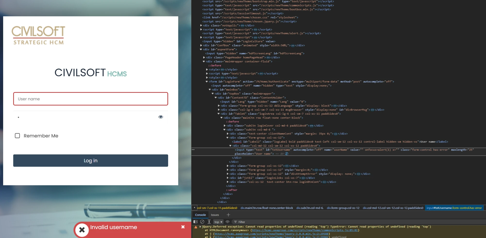
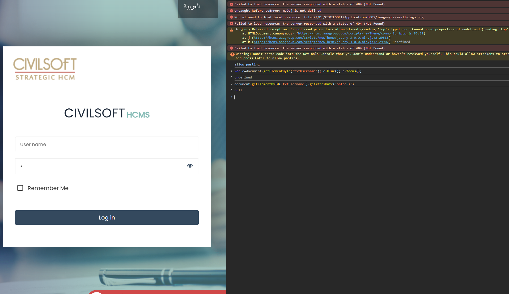
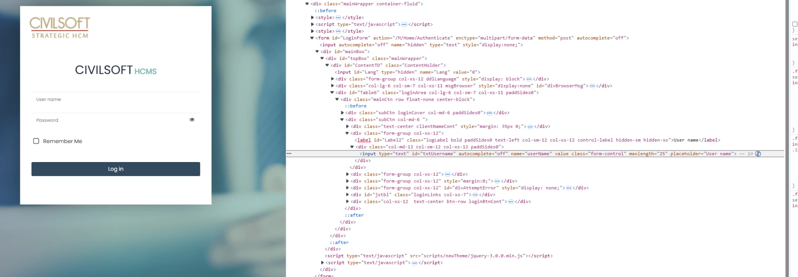
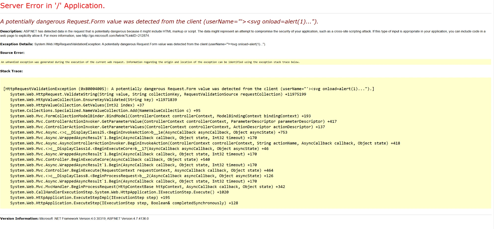

# Web Application Security Findings — CivilSoft HCMS

**Target:** `https://hcms.aaagroup.com`
**Application:** CivilSoft Human Capital Management System (ASP.NET MVC on IIS)
**Assessment type:** Black-box (unauthenticated)
**Date:** 2026-10-07

> All findings below were identified from the **unauthenticated login page only**
> (black-box, no credentials). Deeper/authenticated testing would likely surface more.

## Summary of findings

| # | Finding | Severity | CWE |
|---|---|---|---|
| 1 | Username enumeration via distinct error messages | Medium | CWE-204 |
| 2 | Use of outdated/vulnerable component (jQuery 3.0.0) | Medium | CWE-1104 |
| 3 | Internal file-path disclosure (D:\ path in HTML) | Low | CWE-200 |
| 4 | Verbose error page discloses framework versions | Low | CWE-209 |
| 5 | Internal endpoint disclosure (password-reset & others) | Low | CWE-200 |

---

## 1. Username Enumeration — Medium

**CWE-204: Observable Response Discrepancy**

### Description
The login page returns **different, specific messages** depending on whether the
submitted username exists. Submitting an invalid user returns **"Invalid username"**,
which differs from the response for a valid username with a wrong password. This
lets an attacker distinguish valid from invalid accounts.

### Impact
An attacker can **enumerate valid usernames** (e.g. with Burp Suite Intruder against
a wordlist), building a list of real accounts to feed into **password spraying,
brute-force, or phishing** attacks.

### Evidence
The application explicitly states the username is invalid:



### How to reproduce
1. Submit a random username + any password → observe the message.
2. Submit a likely-valid username (e.g. `admin`) + wrong password → compare the message.
3. Differing responses = enumeration. Automate with **Burp Suite Intruder** over a
   username wordlist, filtering by the "Invalid username" response.

### Remediation
Return a **single generic message** for all failed logins (e.g. *"Invalid username
or password"*) regardless of which part was wrong. Apply the same for the
password-reset flow. Add rate-limiting/lockout to slow enumeration.

---

## 2. Outdated / Vulnerable Component — jQuery 3.0.0 — Medium

**CWE-1104: Use of Unmaintained Third-Party Components**

### Description
The application loads **jQuery 3.0.0**, which has publicly known vulnerabilities.

### Impact
Known issues in this version include:
- **CVE-2020-11022 / CVE-2020-11023** — Cross-Site Scripting (XSS) via `.html()`/
  `.append()` when handling attacker-influenced HTML (fixed in 3.5.0).
- **CVE-2019-11358** — Prototype pollution via `$.extend` (fixed in 3.4.0).

If the application passes untrusted input into jQuery DOM methods, these become
directly exploitable.

### Evidence
Loaded in the page source and confirmed at runtime:
```html
<script src="/scripts/newTheme/jquery-3.0.0.min.js" type="text/javascript"></script>
```
Confirm the running version in the browser console:
```javascript
$.fn.jquery   // returns "3.0.0"
```

### Remediation
Upgrade jQuery to the latest stable release (**≥ 3.7.x**). Establish a process to
track and patch third-party JavaScript libraries.

---

## 3. Internal File-Path Disclosure — Low

**CWE-200: Information Exposure**

### Description
The HTML source references an **absolute internal server file path** on the `D:`
drive for an image resource, exposing the application's installation directory and
directory structure.

### Impact
Reveals the server OS (Windows), drive layout, and install path
(`D:\CIVILSOFT\Application\HCMS\`). This aids an attacker in crafting
**path-traversal, local-file-inclusion, or file-upload** attacks and in
fingerprinting the deployment.

### Evidence
In the HTML source:
```html

```
Confirmed at runtime — the browser attempted to load the local path and logged it:
```
Not allowed to load local resource: file:///D:/CIVILSOFT/Application/HCMS/images/cs-small-logo.png
```





### Remediation
Reference resources using **web-relative paths** (e.g. `/App_Themes/.../logo.png`),
never filesystem paths. Review the codebase for other hardcoded absolute paths.

---

## 4. Verbose Error Page — Framework Version Disclosure — Low

**CWE-209: Generation of Error Message Containing Sensitive Information**

### Description
Submitting unexpected input (e.g. HTML/script characters) triggers a **detailed
ASP.NET error page** containing a full stack trace and exact framework versions,
because `customErrors` is not enabled.

### Impact
Discloses **.NET Framework 4.0.30319** and **ASP.NET 4.7.4136.0**, plus internal
class/method names from the stack trace. An attacker can look up version-specific
exploits and better understand the application internals.

### Evidence


### How to reproduce
Submit a value containing `<` / `>` in the username field — ASP.NET Request
Validation raises `HttpRequestValidationException` and the full error page is shown.

### Remediation
Configure a generic custom error page in `web.config`:
```xml
<customErrors mode="On" defaultRedirect="~/Error" />
```
Also remove version-advertising response headers (`X-AspNet-Version`,
`X-Powered-By`, `Server`).

---

## 5. Internal Endpoint Disclosure — Low

**CWE-200: Information Exposure**

### Description
Client-side JavaScript in the login page reveals several **internal application
endpoints**, including the password-reset functionality.

### Impact
Exposes the application's internal routes, expanding the attack surface for recon.
The **password-reset endpoint** in particular is a high-value target — with further
testing it may be possible to abuse it (e.g. reset another user's password, user
enumeration via the reset response, or parameter tampering).

### Evidence
Endpoints found in the page source / JavaScript:
```
/M/Account/forgottenPassword
/M/Home/ForgetPassword?userName=<user>
/M/Home/InitializeCulture?lang=<n>
/M/Account/ChangePassword
/M/Home/Authenticate
```

### Remediation
This is partly inherent to client-side apps, but:
- Ensure each endpoint enforces **server-side authorization** and anti-automation
  (rate-limiting, CSRF tokens).
- Harden the **password-reset** flow: generic responses, token-based reset with
  expiry, no user enumeration, and strict ownership checks.
- Test `InitializeCulture?lang=` and `ForgetPassword?userName=` for injection/IDOR.

---

## Notes & next steps (recon leads for deeper testing)
- **Default-credential check:** the login fields were observed pre-populated with
  `admin`/`admin` — verify on a clean session whether `admin`/`admin` is accepted.
- **Reflected XSS:** input to `userName` reflects into the input's `value` attribute;
  ASP.NET Request Validation blocks `<>`-based payloads. Attribute-injection
  (`" onfocus=alert(1) x="`) should be re-tested on the **server response** (confirm
  via `getAttribute('onfocus')` returning `alert(1)`) before reporting, to rule out
  DOM-only self-XSS.
- **SQLi:** test the login and `?userName=` / `?lang=` parameters (Request Validation
  does not block SQL metacharacters).
- **Password-reset abuse:** enumerate and test `forgottenPassword` / `ForgetPassword`.

---
*Black-box assessment, unauthenticated. Severities are indicative; confirm with the
client's rating scale. Retest after remediation.*
